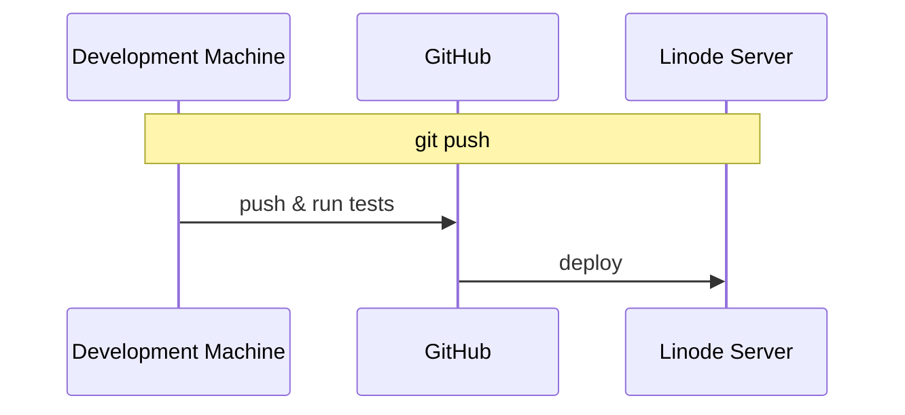
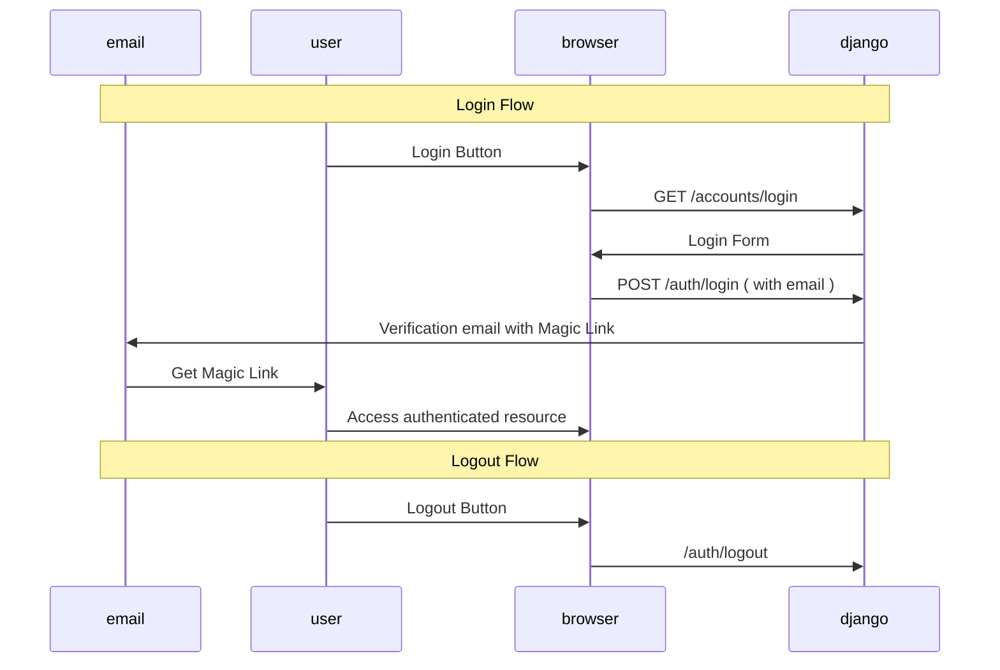

# NiFeK

Personal project to support all the tools I wanted to have available for myself 🪞
Based on https://djangocentral.com/building-a-blog-application-with-django/

# 📝 ToDo

## Code

- Add Load Testing to the app, probably with [Locust](https://www.section.io/engineering-education/how-to-test-django-applications-with-locust/).

## Apps

- Mott: Mottery App.
- Anki: Anki Like app.
- MeBa: Diagram maker to increase our Mental Bandwith.
- Ping: `Uptime Robot` like app.
- Mova: Visually compare Monetary Values.
- Paol: Create a Polling system that allows for multiple questions. On Visualization, allow for the viewing of Paretto Optimal only points.
- Pink: Promise tracker for various events. Sends out a monthly email with the status updates of all subscribers of an event.

## `SEO` optimization

- Add `sitemap.xml`,
- Follow other [suggestions from janowski](https://www.janowski.dev/articles/seo-for-django-5-methods-to-improve-seo/)

# 📚 Tech Stack

- Django: https://www.djangoproject.com/
- Magic Links: https://github.com/pyepye/django-magiclink
- Messages / Notifications: https://docs.djangoproject.com/en/4.1/ref/contrib/messages/
- Form rendering: https://django-crispy-forms.readthedocs.io/en/latest/
- Bootstrap: https://getbootstrap.com/docs/4.0/getting-started/introduction/
- Postgres: https://www.postgresql.org/about/

# 🏌 Development setup

- **Run:** `podman-compose up` or `docker-compose up` Launches the server locally.
  - The app should be available under `0.0.0.0:8000` due to the `ALLOWED_HOSTS` setting.
  - On the web container run `django manage.py createsuperuser` to be able to do the first login as staff, and have the `admin` panel locally available.
  - Emails are saved under the `sent_emails` folder for local development ( Needed for magiclinks )
- **Run Tests locally:** `docker exec` into the running django container, and run `python manage.py test`.
- **Deploying changes:** The deployment to `dokku` and `github` is decoupled.
  - `git push` and `git push origin` send changes to GitHub only.
  - `git push dokku` sends changes to `dokku`.
  - `git push all` sends changes to both. `dokku` runs tests pre-deployment, and rejects the changes if the tests fail 😄

For a multi developer experience, we might want to use `GitHub Actions` as our `CI/CD` and deploy to `Linode` as the last step:

# 🤵 Production environment

- Linode Server `139.144.68.153` hosting with basic DNS
- Domain acquired from NameCheap
- Dokku Apps:
  - Django: `nifek-django-dokku-app`
  - Postgres: `nifek-postgres-dokku-db`
- [Let's Encrypt dokku plugin](https://github.com/dokku/dokku-letsencrypt) used for Managing SSL Certificates
- [Whitenoise](https://whitenoise.evans.io/en/stable/django.html): Responsible for staticfile serving, with caching and compression. Potentially look into
  - optimizing delivery times via CloudFlare or another CDN provider as the source of all StaticFiles.
  - Removing the collectstatic from the predeploy script ( it shouldn't be needed anymore, we need to check that it doesn't destroy the admin panel css though )
- Email: noreplynifek@gmail.com . It was faster to use Google's provided email API than to setup an `SMTP Server`
- **SEO:** Optimized via the addition of title and per page description tags.
- **Parallelization:** Useless at the moment as we're using a single CPU. Note that we can still benefit from concurrency: Long running threads should not block slower ones.

# 🪄 Data Flows

## Auth via MagicLinks

