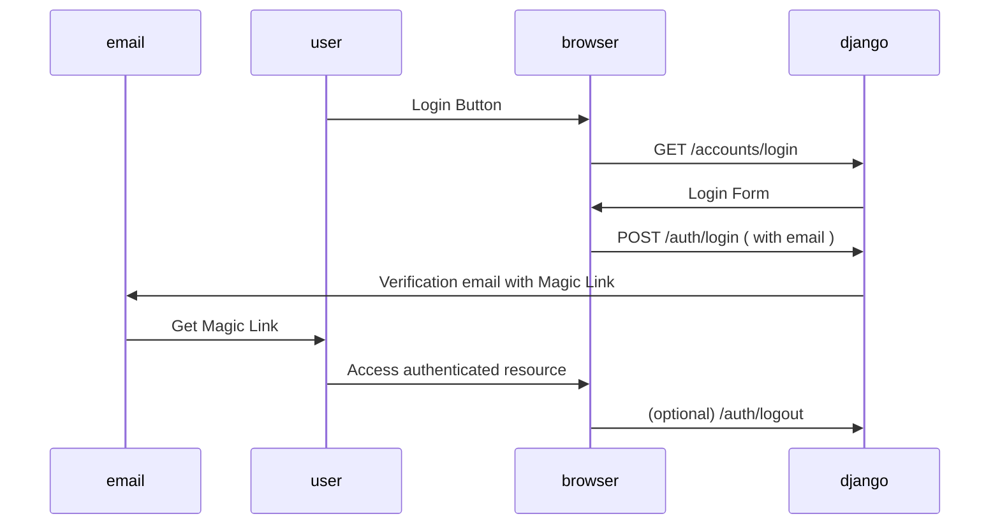

# Nifek

Personal project to support all the tools I wanted to have available, tailored for me :D
Based on https://djangocentral.com/building-a-blog-application-with-django/

# Todo

- Mott: Mottery App
- Anki: Anki Like app
- MeBa: Diagram maker to increase our Mental Bandwith
- Ping: `Uptime Robot` like app
- Mova: Visually compare Monetary Values
- Paol: Create a Polling system that allows for multiple questions. On Visualization, allow for the viewing of Paretto Optimal only points

# Development setup

- **Run:** `podman-compose up` Launches the server locally. You might need to access `127.0.0.1` rather than `0.0.0.0` due to the `ALLOWED_HOSTS` setting.

# Production setup

- Linode Servers hosting with basic DNS
- Domain acquired from NameCheap
- Dokku Apps:
  - Django: `nifek-django-dokku-app`
  - Postgres: `nifek-postgres-dokku-db`
- Let's Encrypt used for Managing SSL Certificates
- [Whitenoise](https://whitenoise.evans.io/en/stable/django.html): Responsible for staticfile serving, with caching and compression. Potentially look into
  - optimizing delivery times via CloudFlare or anothe CDN provider.
  - Removing the collectstatic from the predeploy script ( it shouldn't be needed anymore, we need to check that it doesn't destroy the admin panel css though )
- Email: noreplynifek@gmail.com

# Tech Stack

- Django ;P
- Magic Links: https://github.com/pyepye/django-magiclink
- Messages / Notifications: https://docs.djangoproject.com/en/4.1/ref/contrib/messages/
- Form rendering: https://django-crispy-forms.readthedocs.io/en/latest/
- Bootstrap: https://getbootstrap.com/docs/4.0/getting-started/introduction/
- Postgres 15: https://www.postgresql.org/about/news/postgresql-151-146-139-1213-1118-and-1023-released-2543/

# Data Flows

## Auth

