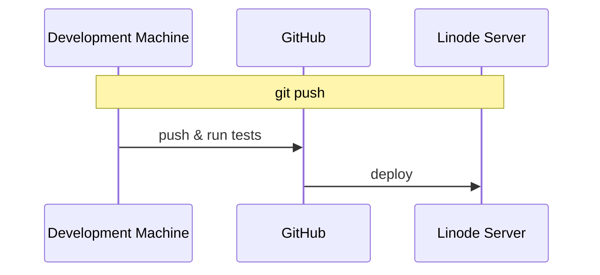
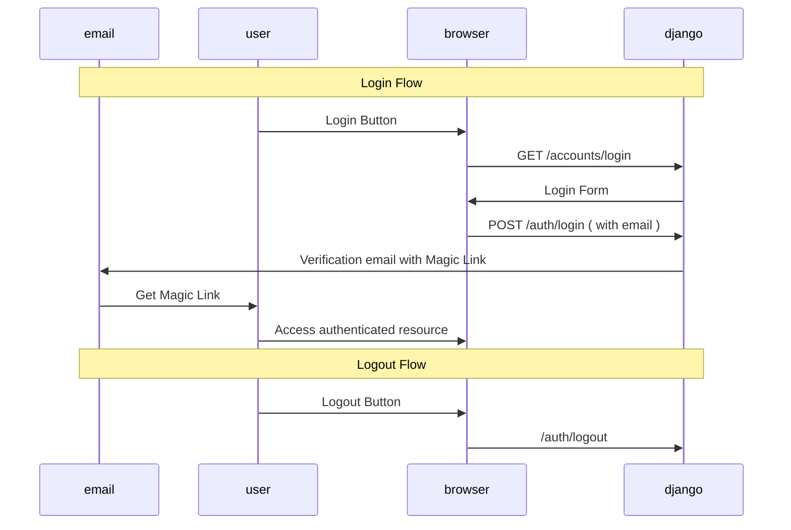

# [NiFeK](https://nifek.com)

[Personal project](https://nifek.com) to support all the tools I wanted to have available 🪞
Initial structure based on a template blog app https://djangocentral.com/building-a-blog-application-with-django/

# 📝 ToDo

## 💻 Code

- Add Load Testing to the app, probably with [Locust](https://www.section.io/engineering-education/how-to-test-django-applications-with-locust/).

## 📱 Apps

- **Mott:** Mottery App.
- **Anki:** Anki Like app.
- **Diam:** Diagram maker to increase our Mental Bandwith.
- **Ping:** `Uptime Robot` like app.
- **Mony:** Visually compare Monetary Values.
- **Paol:** Create a Polling system that allows for multiple questions. On Visualization, allow for the viewing of Paretto Optimal only points.
- **Pink:** Promise tracker for various events. Sends out a monthly email with the status updates of all subscribers of an event.

## 📐 `SEO` optimization

- Add `sitemap.xml`,
- Follow [suggestions from janowski](https://www.janowski.dev/articles/seo-for-django-5-methods-to-improve-seo/)

# 📚 Tech Stack

- [Django](https://www.djangoproject.com/) as the core Framework.
- [Magic Links](https://github.com/pyepye/django-magiclink) to provide passwordless Authentication with email based Magic Links.
- [Messages / Notifications](https://docs.djangoproject.com/en/4.1/ref/contrib/messages/) For displaying relevant messages from the backend to the user.
- [django-crispy-forms](https://django-crispy-forms.readthedocs.io/en/latest/) for Backend provided form rendering.
- [Bootstrap](https://getbootstrap.com/docs/4.0/getting-started/introduction/) for UI/UX.
- [Postgres](https://www.postgresql.org/about/) as a relational solution for our DB.
- [Dependabot](https://github.blog/2020-06-01-keep-all-your-packages-up-to-date-with-dependabot/) to avoid outdated/insecure dependencies.

# 🏌 Development setup

_Remark: Replace `podman-docker` commands with `docker-compose` depending on whether you use `podman` or `docker` as your `container` management solution._

- **Build:** `podman-compose build` to build the `web` and `db` apps ( Django and Postgres respectively ).
- **Run:** `podman-compose up` launches the server locally.
  - The app should be available under `0.0.0.0:8000`. `127.0.0.1` does not work due to the chosen `ALLOWED_HOSTS` setting.
  - On the web container run `django manage.py createsuperuser` to be able to do the first login as staff, and have the `admin` panel locally available.
  - Emails are saved under the `sent_emails` folder for local development ( Needed for magiclinks )
- **Run Tests locally:** `docker exec` into the running django container, and run `python manage.py test`.
- **Deploying changes:** The deployment to `dokku` and `github` is decoupled.
  - `git push` and `git push origin` send changes to GitHub only.
  - `git push dokku` sends changes to `dokku` only.
  - `git push all` sends changes to both. `dokku` runs tests pre-deployment, and rejects the changes if the tests fail 🦺

For a multi developer experience, we might want to use `GitHub Actions` as our `CI/CD` and deploy to `Linode` as the last step:

# 👮‍♀️ Production Environment

## 🔑 Key Info

- Linode Server `139.144.68.153`, with basic DNS
- Domain acquired from https://namecheap.com
- Dokku Apps:
  - Django: `nifek-django-dokku-app`
  - Postgres: `nifek-postgres-dokku-db`

## 📃 SSL Certificate

Solved by [Let's Encrypt dokku plugin](https://github.com/dokku/dokku-letsencrypt).

## 📤 Static File Serving

Solved by [Whitenoise](https://whitenoise.evans.io/en/stable/django.html), which provides caching and compression out of the box. Loading times can be decreased by setting up CloudFlare or another CDN provider as the source of all StaticFiles.

## 📩 Email setup

Email: noreplynifek@gmail.com . It was faster to use Google's provided email API than to setup an `SMTP Server`

## 🚅 Parallelization

Useless at the moment as we're using a single CPU. Note that we can still benefit from concurrency: Long running threads should not block slower ones.

## 🌐 Web Insights

Look into [PageSpeed Insights](https://pagespeed.web.dev/report?url=https%3A%2F%2Fnifek.com%2F&form_factor=desktop) or Lighthouse ( available via Chrome's Dev Tools ). Some optimization via the addition of title and per page description tags has been done, and we score high on the mentioned tools. Nonetheless there's always room for improvement. 🦸‍♀️

# 🪄 Data Flows

## Auth via MagicLinks

